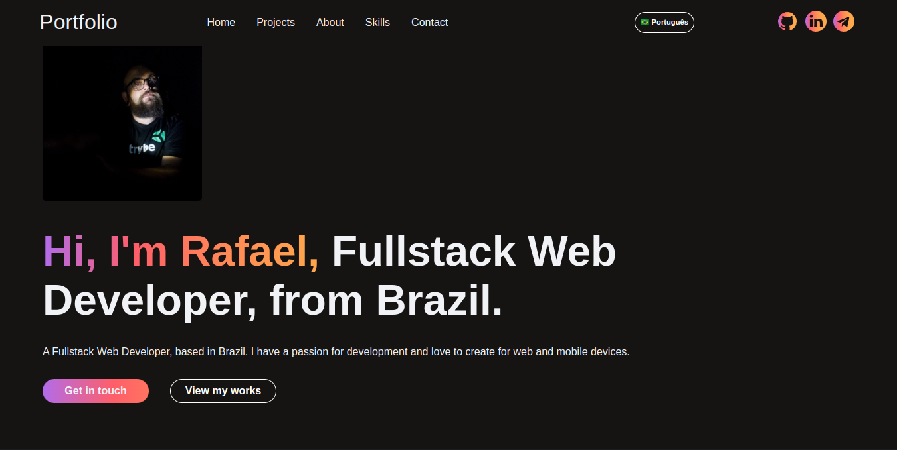

# My Portfólio

This is my personal portfólio. It was built using NextJS, React and TypeScript.
The user can send email to configured email address using EmailJS.
Deployed at https://brandao-rafael-portfolio.up.railway.app/
The design was inspired by [Kartik Bansal](
    https://www.figma.com/@kartikb
)
All variations from the original design can be viewed through [this link](
    https://www.figma.com/community/file/1191026033275812161/Xfolio---Portfolio-website-UI-Kit
)


## Technologies Used

- NextJS
- TypeScript
- React
- Redux

## environment variables
If you want to run this project locally, you will need to create a `.env` file in the root directory and add the following variables:
```
SERVICE_ID=email_service_id
TEMPLATE_ID=emailjs_template_id
EMAILJS_PUBLIC_KEY=emailjs_public_key
// You can get your public key in https://dashboard.emailjs.com/admin
// if you don't have an account, you can create one for free
// https://www.emailjs.com/docs/

```
## Installation

1. Clone the repository.
2. Run `npm install`.
3. Run `npm run start`.

## Screenshots



## Contributing

1. Fork the repository.
2. Create a new branch.
3. Make your changes.
4. Submit a pull request.

## License

You are free to use this code as you wish. No credit is required. But remenber, this is a personal portfólio, so you should not use my personal information in your project.
